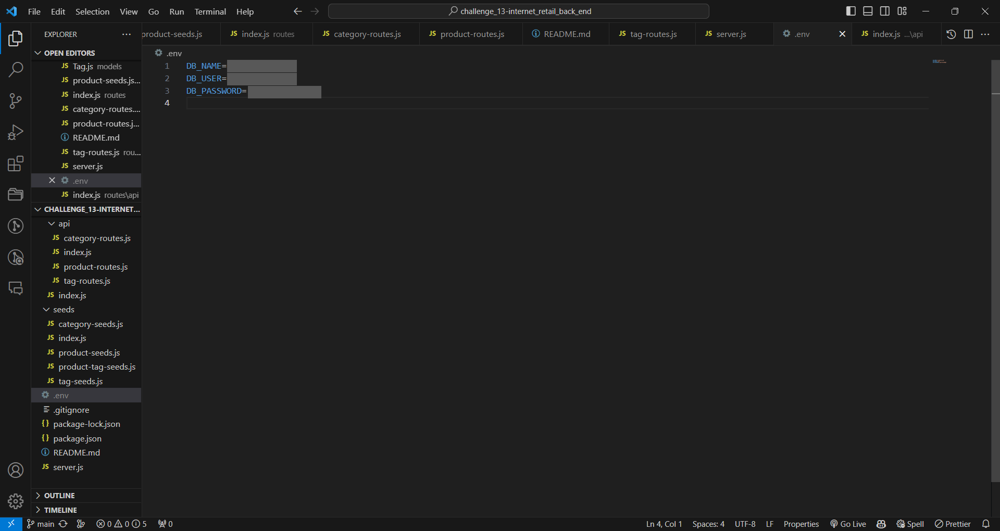
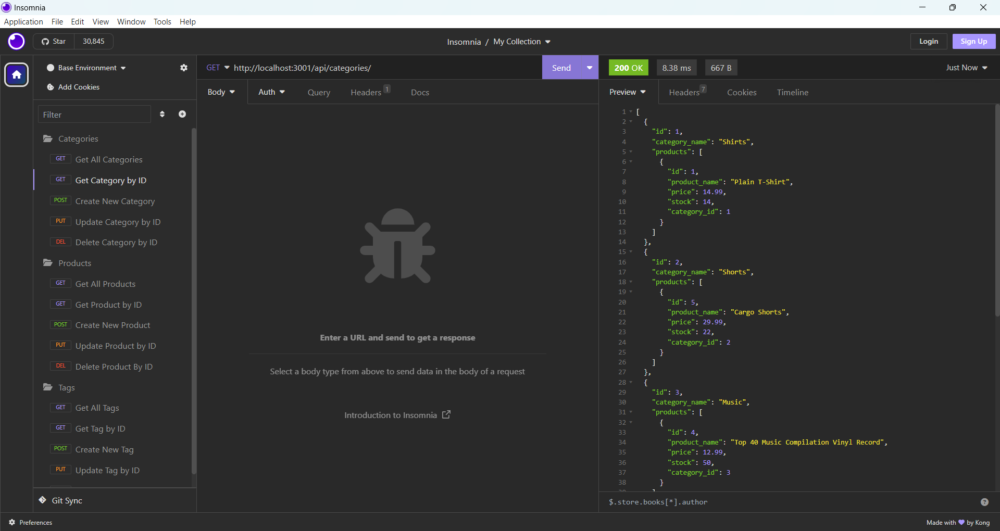
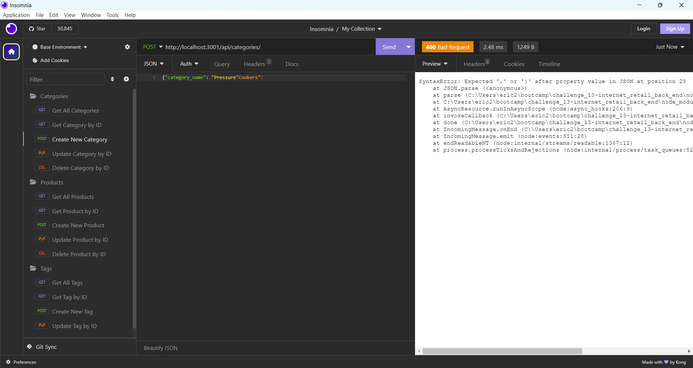
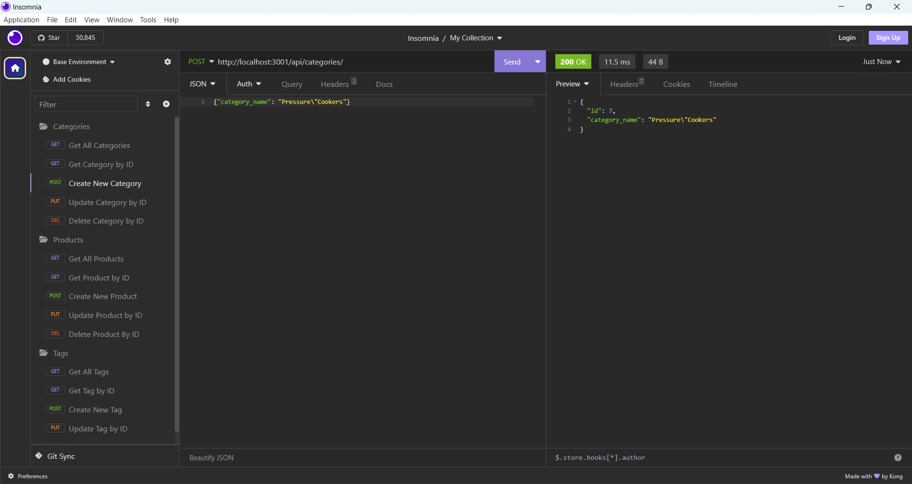
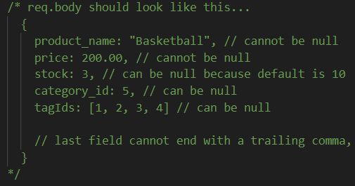
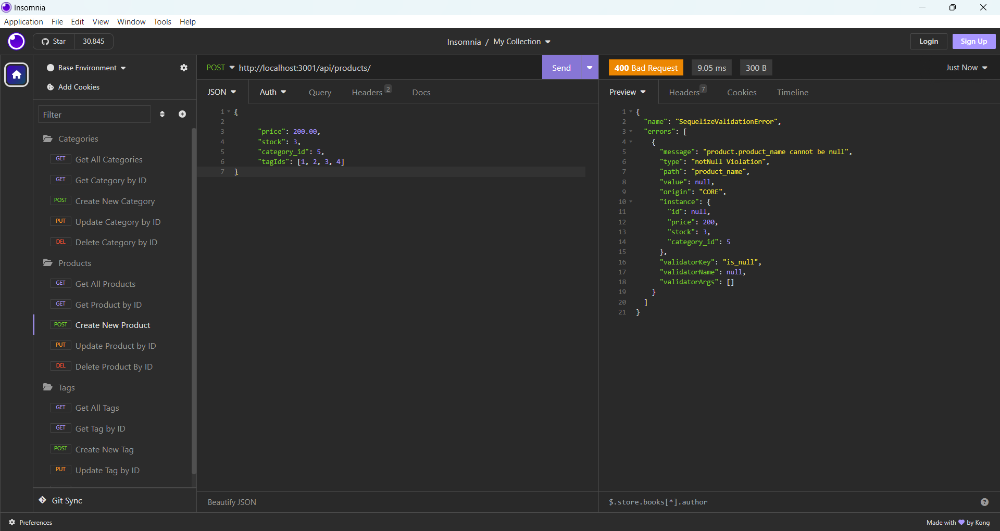
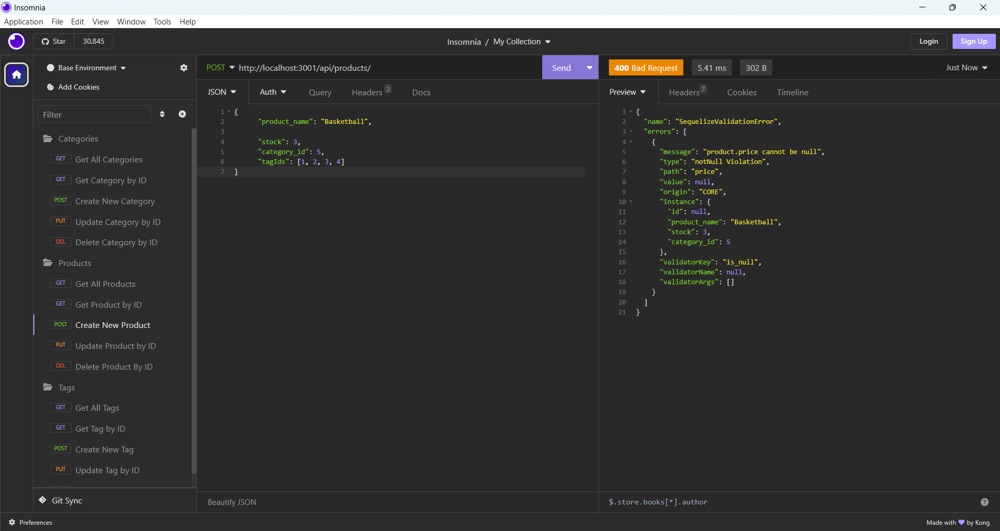

# Challenge 13: Internet Retail Back End

## Description
Online stores such as Amazon, DoorDash, and Instacart are a major part of most people's lives. As a person uses these services, they might wonder how an e-commerce site works behind the scenes. This project explores how an online store would organize and connect its categories, products, and tags. Once you source the schema, seed the data, and start the server (in that order), you can open Insomnia on your computer and test various routes. For all three types of data, you can get all items, create a new item, and get/update/delete an item by its ID. This project taught me how to start up an application using MySQL commands, create models and build associations, and write CRUD (Create, Read, Update, Delete) routes to retrieve or manipulate data.

## Table of Contents
- [Description](#description)
- [Installation](#installation)
- [Usage](#usage)
- [Credits](#credits)
- [Contributing](#contributing)
- [Tests](#tests)
- [License](#license)
- [Questions](#questions)

## Installation
No installation is required for this project. However, it is recommended to create a `.env` file in this repository on your own computer. You can store important information such as the database name, your mysql username, and your mysql password,  as shown below:

**Important:** It is necessary to create this file because the `.env` file on my computer is gitignored and thus excluded from my repository. Without creating your own `.env` file, you may experience trouble connecting to the MySQL database.

**Note:** these directions assume that your MySQL login credentials have already been set up. If this is not the case, you would have to create an account prior to creating a `.env` file.

## Usage
The functionality of the application is demonstrated by [this walkthrough video](https://www.youtube.com/watch?v=aFXkU_Sb8r4).

**Special cases to consider:**

1. The only difference between `Get All Categories` and `Get Category by ID` is that `Get Category by ID` ends with an ID while `Get All Categories` does not. If you remove the ID from the `Get Category by ID` route, it will function the same as `Get All Categories`.

2. Any category, product, or tag names that contain a backslash `\` or a double quote `"` **must** be escaped by an additional backslash. Otherwise, Insomnia will be unable to parse the JSON with invalid syntax, as shown in the following four images:

**Backslash \\**

**Incorrect:**

**Correct:**

**Double Quote "**

**Incorrect:**

**Correct:**

3. When you create a new product, make sure to format it like this:

The fields that cannot be null will cause Sequelize validation errors to occur if they are left empty.

**Leaving out the product name:**

**Leaving out the price:**

## Credits
Received help from AskBCS assistant Keegan and from instructor Robbert Wijtman in the *#02-ask-the-class* Slack channel.

The following web resources helped me write the code for this project:

1. [How to build models using autoIncrement](https://sequelize.org/docs/v6/core-concepts/model-basics/)
2. [Naming strategies for models](https://sequelize.org/docs/v7/models/naming-strategies/)
3. [Building associations and assigning foreign keys](https://openclassrooms.com/en/courses/2071486-retrieve-data-using-sql/5758019-create-an-association-table)
4. [Syntax errors in JSON](https://udn.realityripple.com/docs/Web/JavaScript/Reference/Errors/JSON_bad_parse)
5. [Model synchronization in Sequelize](https://sequelize.org/docs/v7/models/model-synchronization/)

## Contributing
I attempted to write error messages for certain types of faulty user input, but I was unable to do that without causing the error `Cannot set headers after they are sent to the client`. If someone could help me figure out how to write specific messages, I would appreciate it.

## Tests
No tests have been written for this application.

## License
No license is attached to this repository.

## Questions
If you have any questions for me, you can [follow me on GitHub](https://github.com/GimmeKitties711) or email me at eric20wang.wang@gmail.com.
